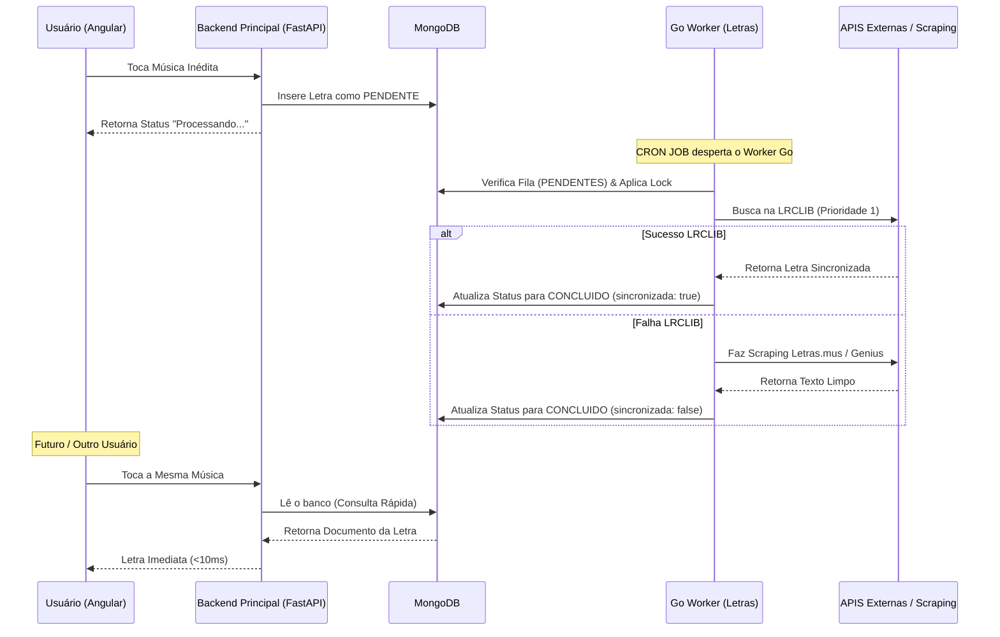

# 📻 Tunify Letras Microservice (Worker & API em Go)

[](https://go.dev/)
[](https://www.mongodb.com/)
[](https://github.com/athosdanilo/tunify)

Este é o microserviço oficial de captura, processamento e sincronização de letras musicais do ecossistema **Tunify** — uma plataforma de Engenharia Musical e curadoria algorítmica orientada a dados. 

---

## 🎯 O que é o Tunify?

O **Tunify** é uma plataforma de "Engenharia Musical" e curadoria algorítmica que estende as capacidades nativas do ecossistema Spotify. Utilizando **Ciência de Dados (Data Science)** e **Teoria dos Grafos**, o Tunify capacita o usuário a atuar como um arquiteto de suas próprias playlists, oferecendo controle granular sobre a experiência auditiva através da manipulação de vetores matemáticos como Valência, Energia e Tempo.

O **Tunify Letras Microservice** nasce para preencher uma lacuna fundamental na experiência imersiva da plataforma: o fornecimento de letras de música estruturadas e, sempre que possível, perfeitamente sincronizadas com o tempo da reprodução (estilo Karaokê), complementando as complexas jornadas sonoras geradas pelo sistema central.

---

## 💡 Arquitetura do Sistema e Design Dinâmico

Para garantir resiliência, baixo consumo de infraestrutura e performance instantânea, o microserviço foi reestruturado sob os seguintes pilares de engenharia:

### 1. Consumo Instantâneo vs. Processamento Assíncrono (Trade-off)
Fazer varreduras em sites externos em tempo real gera latência e instabilidade. Na nova arquitetura, o aplicativo Angular nunca espera o robô fazer o scraping. 
* Se uma música nunca foi tocada na plataforma antes, ela entra na fila com o estado `PENDENTE`. O front-end exibe uma mensagem amigável informando que o processamento foi agendado.
* A partir da segunda vez que qualquer usuário tocar a mesma música no ecossistema Tunify, a letra já estará disponível para consumo imediato diretamente do banco de dados, carregando em menos de 10 milissegundos.

### 2. O Robô com "Horário de Expediente" (Cron Job com Lock de Segurança)
Para evitar o consumo contínuo e desnecessário de CPU em plataformas Serverless/PaaS, o robô em Go não roda em loop infinito na nuvem.
* Ele é despertado periodicamente através de um gatilho agendado (Cron Job) ou chamada HTTP.
* **Mecanismo de Lock (Trava):** Para evitar condições de corrida (*Race Conditions*) — como o robô acordar novamente enquanto o ciclo anterior ainda está processando uma fila longa —, a primeira ação do Go é verificar e criar uma "Trava de Processamento" no banco. Se o robô anterior ainda estiver ativo, a nova instância encerra sua execução pacificamente.

### 3. Estratégia de Busca em Cascata (Degradação Suave / Fallback)
O robô opera em três níveis de prioridade para cobrir o cenário global e o acervo nacional brasileiro:
1. **Nível Ouro (LRCLIB):** Tenta buscar a letra na API da LRCLIB. Se encontrar, extrai o texto com os metadados de tempo (`[00:12.50]Texto`), salvando com a flag `sincronizada: true` para ativar a interface Karaokê no Angular.
2. **Nível Prata (Letras.mus.br / Genius):** Caso não possua sincronia, o robô realiza o *web scraping* tradicional consolidando o texto limpo, salvando com `sincronizada: false` (modo rolagem simples).
3. **Nível Bronze (Não Encontrada):** Se esgotadas as tentativas em todas as fontes, o status vai para `NAO_ENCONTRADA`, impedindo requisições inúteis em execuções futuras.

### 4. Limites de Hardware e Proteção Anti-Banimento (Free Tier)
Como este sistema será hospedado em infraestruturas *Free Tier* de nuvem, possuímos limites rígidos mensais de tempo de processamento. Para evitar estouro de infraestrutura e bloqueios permanentes (IP Ban / Anti-DDoS) por parte dos provedores de letras, adotamos a estratégia do **Trabalhador Calmo**:
* **Operação Constante e Lenta:** O robô não varre as pendências de uma vez. O *Cron* o desperta a cada 15 a 30 minutos para processar *micro-lotes* (ex: 2 a 3 letras por vez).
* **Pausas Humanizadas (Jitter):** Para mascarar o *scraping*, a aplicação insere *Sleeps* (pausas) fixos de cerca de 5 segundos entre as requisições de um lote, imitando perfeitamente a navegação de um ser humano.
* **Cota Diária Limitada:** O serviço é travado para processar um teto máximo de 100 músicas por dia (24h).
* **Distribuição Justa (*Fair Queuing*):** Para evitar que um "super usuário" domine toda a fila ao sincronizar milhares de músicas e deixe os demais na espera, a cota de 100 letras diárias é dividida igualmente. Na nossa versão beta, a integração do Spotify é restrita a 5 usuários simultâneos, resultando na limitação estrita de busca de **até 20 músicas diárias por usuário**. Se sobrar cota de usuários inativos, o sistema fará um balanceamento redistribuindo para os mais necessitados (Round Robin).

---

## 🔄 Fluxo de Processamento de Letras



---

## 🗃️ Estrutura do Banco de Dados (Schema MongoDB)

A coleção `Letras` foi padronizada para garantir clareza semântica:

```json
{
  "_id": "ObjectId('...')",
  "id_musica_spotify": "3yfqSUWxFvZELEM4PmlwIR",
  "id_usuario": "ObjectId('...')",
  "nome_musica": "Yellow",
  "nome_artista": "Coldplay",
  "status": "PENDENTE",
  "texto_letra": null,
  "sincronizada": false,
  "fonte_letra": null,
  "tentativas_processamento": 0,
  "criado_em": "2026-05-27T13:00:00Z",
  "atualizado_em": "2026-05-27T13:00:00Z"
}
```

### Ciclo de Vida dos Estados (`status`):
* `PENDENTE`: Música recém-identificada aguardando ativação do robô.
* `PROCESSANDO`: O robô capturou a faixa da fila e está operando (*lock*).
* `CONCLUIDO`: Letra extraída com sucesso e pronta para consumo.
* `NAO_ENCONTRADA`: Esgotadas todas as tentativas de busca.

---

## 🚀 Como Executar Localmente

### Pré-requisitos
- [Go 1.20+](https://go.dev/) instalado.
- Acesso a um banco [MongoDB](https://www.mongodb.com/) (Local ou cluster Atlas).

### 1. Clonar e Instalar Dependências
```bash
git clone https://github.com/athosdanilo/tunify-letras.git
cd tunify-letras
go mod download
```

### 2. Configurar Variáveis de Ambiente
Crie um arquivo `.env` na raiz do projeto contendo as credenciais de acesso:
```env
MONGO_URI=mongodb+srv://<usuario>:<senha>@cluster.mongodb.net/?retryWrites=true&w=majority
DATABASE_NAME=tunify
MAX_DAILY_QUOTA=100
MAX_PER_USER_QUOTA=20
```

### 3. Executar o Serviço
Para rodar o microserviço em modo de desenvolvimento:
```bash
go run main.go
```

Para gerar um binário compilado (ideal para implantação em produção):
```bash
go build -o tunify-letras main.go
./tunify-letras
```

---

## 🛠️ Tecnologias Utilizadas
* **Linguagem:** Go (Golang) — Concorrência nativa e geração de binários minúsculos.
* **Scraping & Parsing:** `goquery` — Navegação idiomática no DOM HTML.
* **Banco de Dados:** MongoDB (Driver Oficial `go.mongodb.org/mongo-driver`).
* **Rede/APIs:** Biblioteca padrão `net/http` do Go, eliminando dependência de *frameworks* pesados.
